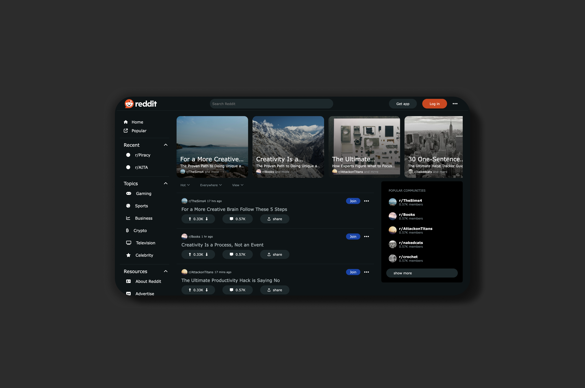

# Reddit Clone (Clone Project)

This project is a Reddit clone built using React and Vite. It is a practice project aimed at honing React fundamentals and hooks. It is my first proper React project, it is not functional but uses the State Hook to build simple accordion menus.

## Purpose

The main purpose of this project is to provide a sandbox environment for experimenting with React concepts such as component composition, state management, and useEffect hook.

## Features

- Placeholder content: The clone project includes placeholder data for subreddits, posts, and user interactions.
- Mock functionality: While the app appears functional, it does not have real backend integration or user authentication. Actions like upvoting, commenting, and creating posts do not have backend logic.
- Practice environment: I used this project to practice building components, managing state, and implementing React features without the complexity of a fully functional Reddit clone.

## Technologies Used

- React: A JavaScript library for building user interfaces.
- Vite: A next-generation front-end build tool that significantly improves the frontend development experience.

## Installation

1. Clone the repository: `git clone https://github.com/yourusername/clone-reddit.git`
2. Navigate to the project directory: `cd clone-reddit`
3. Install dependencies: `npm install`
4. Start the development server: `npm run dev`

## Usage

- Explore the codebase to understand how React components are structured.
- Experiment with modifying components, adding new features, or improving existing ones.
- Practice using React hooks like useState, useEffect, useContext, etc.
- Test your changes locally to see how they affect the user interface and functionality.

## Contributing

Contributions are welcome! If you have any suggestions, bug fixes, or improvements, feel free to open an issue or submit a pull request.
